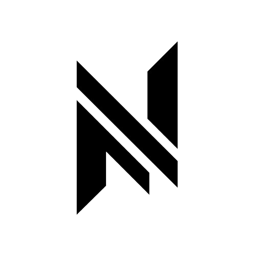

<!-- Section splitter comments because clean freak -->
# Null

  

<!-- Section splitter comments because clean freak -->
## About

Hi, I'm Sophie, also known as sophie Black.

I create code and work on plugins, clients, and automation tools within the gaming industry. My focus is building practical software that improves gameplay experiences, supports communities, and helps projects run more efficiently.

I own the group known as Null, which originally started on 2b2t more than 10 years ago. What began as a long-running gaming community has grown into a development-focused group centered around building tools and software for the spaces we care about.

<!-- Section splitter comments because clean freak -->
## What I do

- Plugin development
- Client-side tooling
- Automation scripts and utilities
- Game-focused software engineering
- Community-driven development projects

<!-- Section splitter comments because clean freak -->
## Mission

While Null no-longer remains active within 2B2T as of 2024, we have moved our ventures into other areas. A lot of us moved onto different games, but we have recently started to dabble into a clone server of 2B2T called 6B6T.

<!-- Section splitter comments because clean freak -->
## Origin

Null began on 2b2t over a decade ago and has continued to evolve as a project and a community. The name carries the legacy of that early history while continuing to grow into modern software development.
